# HabitFlow - Habit Tracking Application

A full-featured web application for tracking personal habits with analytics, calendar, and multi-user support.

## Table of Contents

- [Project Overview](#project-overview)
- [Quick Start](#quick-start)
- [Project Structure](#project-structure)
- [Features](#features)
- [API Documentation](#api-documentation)

---

## Project Overview

HabitFlow is built with modern technologies:

Backend:
- Node.js and Express.js
- MongoDB Atlas (cloud database)
- JWT authentication
- Nodemailer (email notifications)

Frontend:
- React 18 with Vite
- TailwindCSS
- Axios and React Router

Key Features:
- Create, edit, and manage habits
- Track daily habit completion
- View analytics and progress statistics
- Calendar view with daily tracking
- Email notifications
- Admin panel for user management
- Multi-user support

---

## Quick Start

### Requirements
- Node.js 18+ 
- npm or yarn
- MongoDB Atlas account

### Run in 30 seconds

cd habit-tracking-app-main
npm install
npm run dev
# Open http://localhost:5173

## Features

### Authentication
- User registration and login
- JWT token-based authentication
- Secure password handling

### Habit Management
- Create, edit, delete habits
- Set habit categories and frequency
- Track completion streaks
- View habit statistics

### Daily Tracking  
- Calendar view with daily tracking
- Record mood and energy levels
- Add notes for each day
- Mark habits as completed

### Statistics
- Daily, weekly, monthly analytics
- Success rate tracking
- Streak statistics
- Category-based analysis

### Admin Features
- View all users
- Manage user roles
- Delete user accounts
- System statistics

---

## API Documentation

### Authentication Endpoints

Register User
POST /api/auth/register
Content-Type: application/json

{
  "username": "dav1dka",
  "email": "dav1dka@example.com",
  "password": "password123",
  "displayName": "David"
}

Response (201):
{
  "token": "eyJhbGc...",
  "user": { "id": "...", "username": "dav1dka, "email": "dav1dka@example.com" }
}

Login
POST /api/auth/login
Content-Type: application/json

{
  "emailOrUsername": "dav1dka",
  "password": "password123"
}

### User Endpoints (JWT Required)

Get Profile
GET /api/users/profile
Authorization: Bearer <token>

Update Profile
PUT /api/users/profile
Authorization: Bearer <token>

{
  "email": "newemail@example.com",
  "displayName": "New Name"
}

Get Statistics
GET /api/users/stats
Authorization: Bearer <token>

### Habit Endpoints (JWT Required)

Create Habit
POST /api/habits
Authorization: Bearer <token>

{
  "name": "Morning Jog",
  "description": "30 minutes daily",
  "category": "health",
  "frequency": "daily",
  "colorCode": "#4CAF50",
  "icon": "running"
}

Get All Habits
GET /api/habits
Authorization: Bearer <token>

Get Habit
GET /api/habits/:id
Authorization: Bearer <token>

Update Habit
PUT /api/habits/:id
Authorization: Bearer <token>

{
  "name": "Updated Habit Name",
  "frequency": "daily"
}

Delete Habit
DELETE /api/habits/:id
Authorization: Bearer <token>

### Days Endpoints (JWT Required)

Create Day
POST /api/days
Authorization: Bearer <token>

{
  "date": "2024-01-20",
  "mood": 4,
  "energy": 3,
  "habits": ["habitId1", "habitId2"],
  "notes": "Great day!"
}

Get All Days
GET /api/days
Authorization: Bearer <token>

Update Day
PUT /api/days/:id
Authorization: Bearer <token>

{
  "mood": 5,
  "energy": 4,
  "notes": "Even better!"
}

Delete Day
DELETE /api/days/:id
Authorization: Bearer <token>

### Check-in Endpoints (JWT Required)

Record Completion
POST /api/habits/:habitId/checkins
Authorization: Bearer <token>

{
  "date": "2024-01-20",
  "value": 30,
  "notes": "Completed"
}

Get Check-ins
GET /api/habits/:habitId/checkins
Authorization: Bearer <token>

### Admin Endpoints

Get All Users
GET /api/admin/users
Authorization: Bearer <token>

Change User Role
PUT /api/admin/users/:userId/role
Authorization: Bearer <token>

{
  "role": "admin"
}

Delete User
DELETE /api/admin/users/:userId
Authorization: Bearer <token>

## Available Commands

npm run dev              # Start both servers in development mode
npm run server           # Start backend only (dev)
npm run server:start     # Start backend for production
npm run client           # Start frontend only (dev)
npm run client:build     # Build frontend for production
npm run client:preview   # Preview production build

---

## Development Notes

- Backend runs on port 5000 with hot-reload via nodemon
- Frontend runs on port 5173 with Vite HMR
- All passwords are hashed using bcryptjs
- MongoDB Mongoose ODM is used for database operations
- CORS is configured for localhost:5173

---

## Troubleshooting

If you encounter issues:

1. Check browser console (F12) and terminal logs
2. Verify all environment variables are set correctly  
3. Ensure MongoDB Atlas connection is working
4. Check that ports 5000 and 5173 are not in use
5. Clear node_modules and reinstall if needed

---

## Screenshots of Features

### 1. Authentication Page
Description: User registration and login interface with validation.
- Clean two-column design
- Left side: HabitFlow branding and feature highlights
- Right side: Login/Register form tabs
- Email and password validation
- Secure JWT token handling
- Responsive design for mobile and desktop
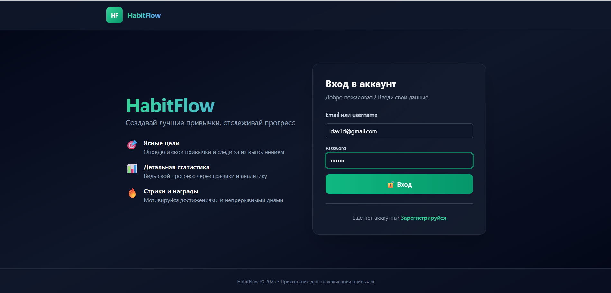
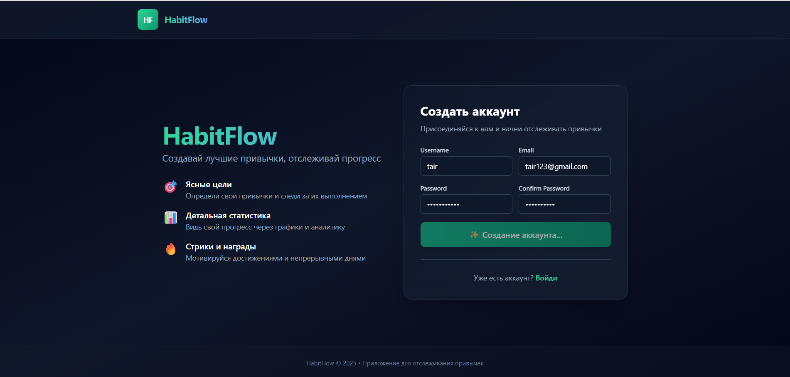

### 2. Habit Management Page
Description: Create, view, and manage all personal habits.
- List view of all habits with statistics
- Create new habit button with modal form
- Edit and delete functionality for each habit
- Habit parameters: name, category, frequency, color code, icon
- Display current streak, longeststreak, and success rate
- Filter habits by category (optional)
- Color-coded habit cards for visual organization
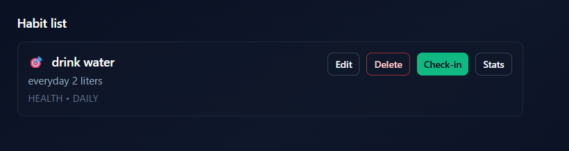
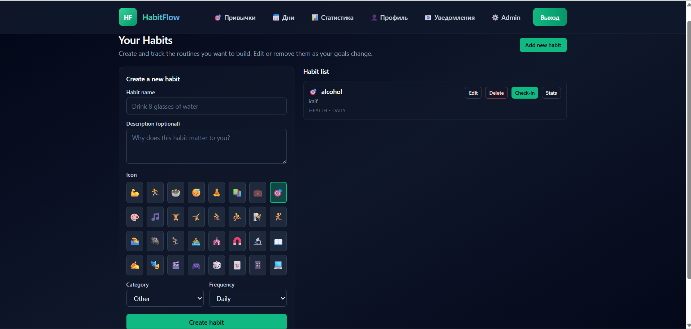

### 3. Daily Tracking Calendar
Description: Calendar interface for tracking daily habit completion.
- Left sidebar: Monthly calendar with navigation
- Right panel: Selected day details
- Record mood (1-5 scale) and energy level (1-5 scale)
- Checkbox list of habits for completing/uncompleting
- Add notes for each day
- Complete day button for finalization
- Visual indicators for completed days
- Delete completed days functionality
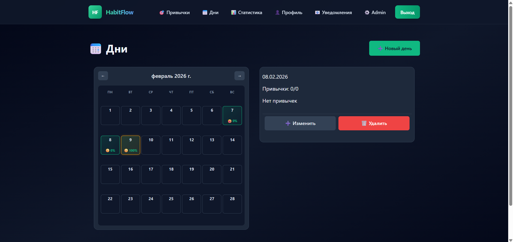
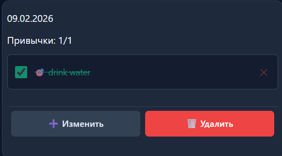
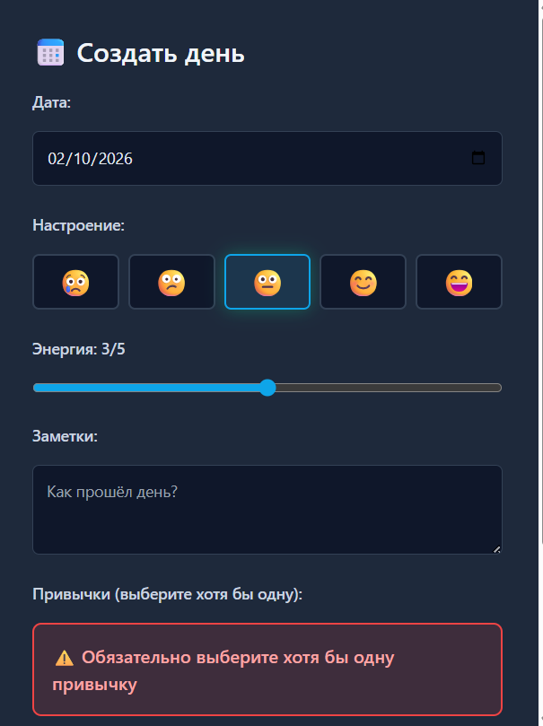

### 4. Statistics Dashboard
Description: Comprehensive analytics and progress tracking.
- Daily completion statistics and success percentage
- Weekly trend analysis with bar charts
- Monthly progress overview with line graphs
- Habit statistics by category and frequency
- Top performing habits ranking
- Current and longest streak tracking
- Success rate visualization per habit
- Filter statistics by time period and category
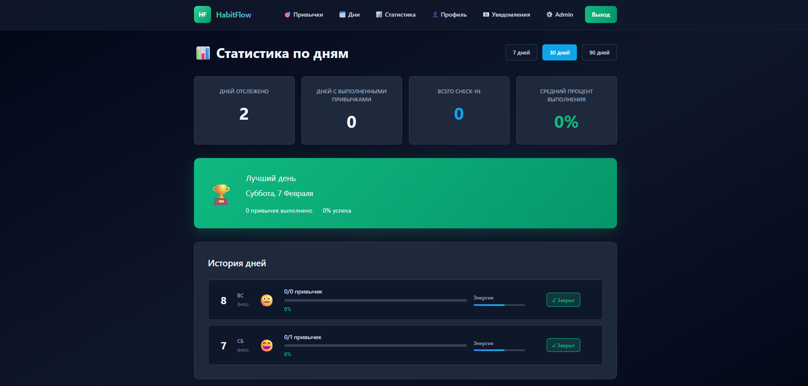

### 5. User Profile Page
Description: Manage user account and settings.
- View and edit profile information
- Change email and display name
- Update password securely
- Configure notification preferences
- View overall account statistics
- Timezone and language settings
- Logout functionality
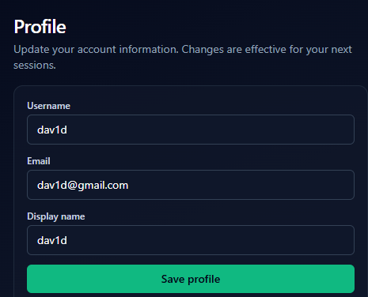
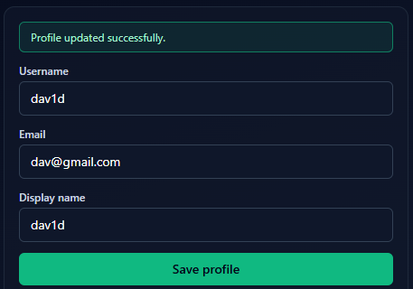

### 6. Admin Dashboard
Description: User management and system administration (admin only).
- View all registered users in table format
- Promote/demote users to/from admin role
- Delete user accounts and associated data
- System-wide statistics and analytics
- Monitor user activity
- User role management interface
- Search and filter users
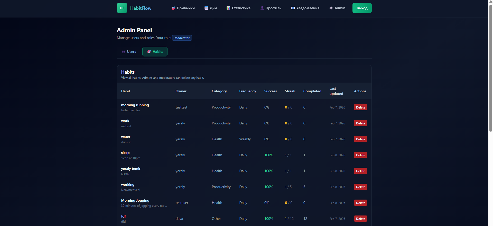
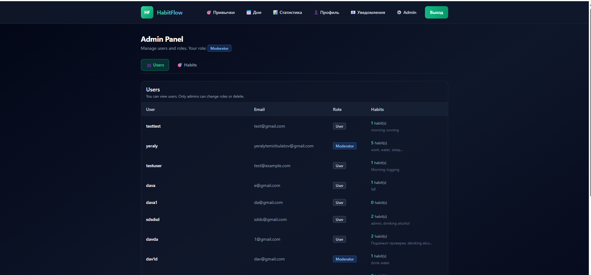

### 7. Habit Creation Form
Description: Detailed form for creating new habits.
- Habit name input field
- Description text area
- Category selection dropdown (health, productivity, learning, wellness, social)
- Frequency selection (daily, weekly, monthly)
- Color code picker for habit identification
- Icon/emoji selector
- Optional: Days of week selector for weekly habits
- Form validation and error handling

### 8. Email Notifications
Description: Email reminders and progress reports sent to users.
- Habit completion reminders
- Weekly progress summary emails
- Achievement milestone notifications
- Custom email templates
- SMTP integration support (Mailgun, SendGrid)
- Configurable notification frequency
- Unsubscribe option
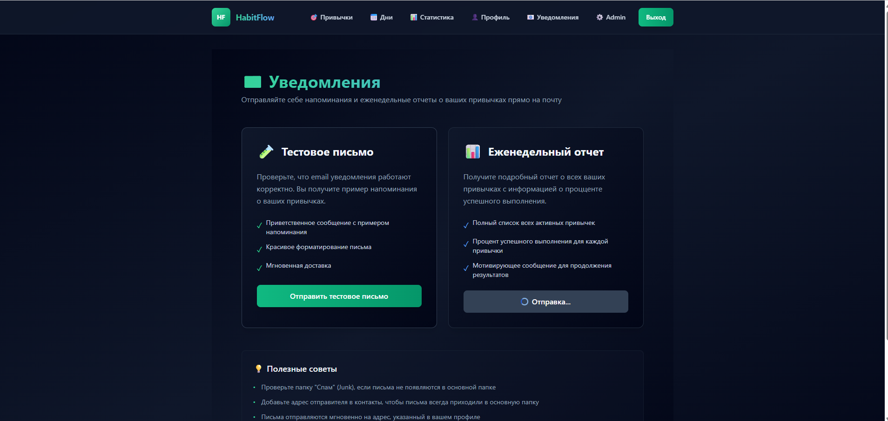
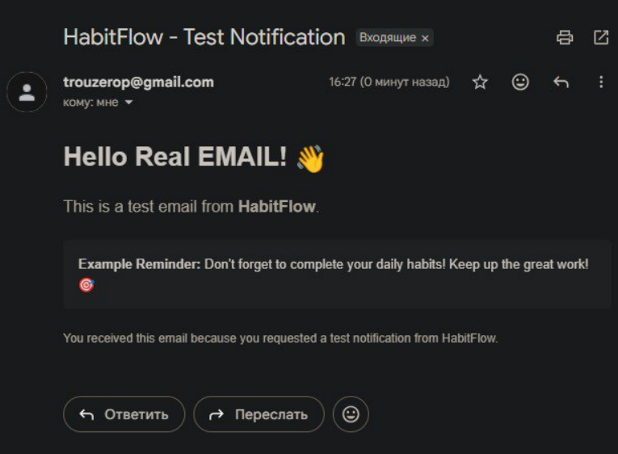
---

## Technology Stack Details

Backend Architecture:
- Express.js REST API with RESTful endpoint design
- MongoDB Mongoose ODM for data modeling
- bcryptjs for password encryption
- JWT for token-based authentication
- CORS middleware for cross-origin requests
- Error handling and validation middleware
- Nodemailer for email notifications

Frontend Architecture:
- React 18 with functional components and hooks
- Vite for fast development and optimized builds
- TailwindCSS for responsive utility-first styling
- Axios for API communication
- React Router for navigation and page routing
- localStorage for token persistence
- Responsive mobile-first design

Database:
- MongoDB Atlas cloud database
- Multi-user support with document isolation
- Indexing for query optimization
- Connection pooling for performance

## Links

GitHub Repository: https://github.com/ETairkhan/habit-tracking-app
Deployed Project: https://habit-tracking-app-2-vykk.onrender.com
